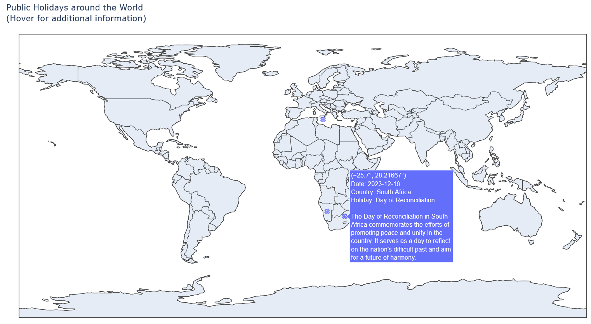

# Global Public Holidays

- [Summary](#summary)
- [Features](#features)
- [Prerequisites](#prerequisites)
- [Installation](#installation)
  - [Docker](#docker)
  - [Nix](#nix)
- [Contributing](#contributing)


# Summary

The Global Public Holidays explorer is a fun project that provides a platform for displaying public holidays from around the world along with detailed information about each holiday.




# Features

 - **Worldwide Coverage:** Access an extensive database of public holidays from diverse countries using the wonderful (and free) [Nager.AT](https://date.nager.at/) API.

 - **Informative Details:** Get in-depth information about each holiday, including its origin, significance, traditions, and any associated historical or cultural context. This feature ensures that users gain a deeper understanding of the holidays they are exploring.

 - **User-Friendly Interface:** Enjoy a clean and intuitive interface for seamless navigation. The repository is designed with simplicity in mind, I use the plotly library to display a map of the world and pin each holiday on the map.

# Prerequisites

In order to retrieve detailed descriptions about each holiday, an OpenAI API key needs to be set as the `OPENAI_API_KEY` environment variable.
For example:
```bash
export OPENAI_API_KEY="YOUR API KEY"
```

To generate your API key, visit the [OpenAI portal](https://platform.openai.com/api-keys) and _Create a new secret key_

# Installation


## Docker

- Pull image from Github Container Registry
```bash
docker pull ghcr.io/mahalel/global-public-holidays:latest
```

- Run image (Supply the OpenAI api key as an environment var)
```bash
docker run -d \
  --name public-holidays \
  -p 8050:8050 \
  -e OPENAI_API_KEY="YOUR API KEY" \
  ghcr.io/mahalel/global-public-holidays:latest
```

- Open App by browsing to http://localhost:8050

- Stop the container

```bash
docker stop public-holidays
```

- Remove the container

```bash
docker rm public-holidays
```

## [Nix](https://nix.dev/)

A nix flake is supplied, to run the program simply:

- Clone the Repository: Clone the repository to your local machine using the provided Git commands.

```bash
git clone https://github.com/your-username/global-holidays-explorer.git
cd global-holidays-explorer
nix develop
cd src && python app.py
```


- Open App by browsing to http://localhost:8050


# Contributing

TODO
