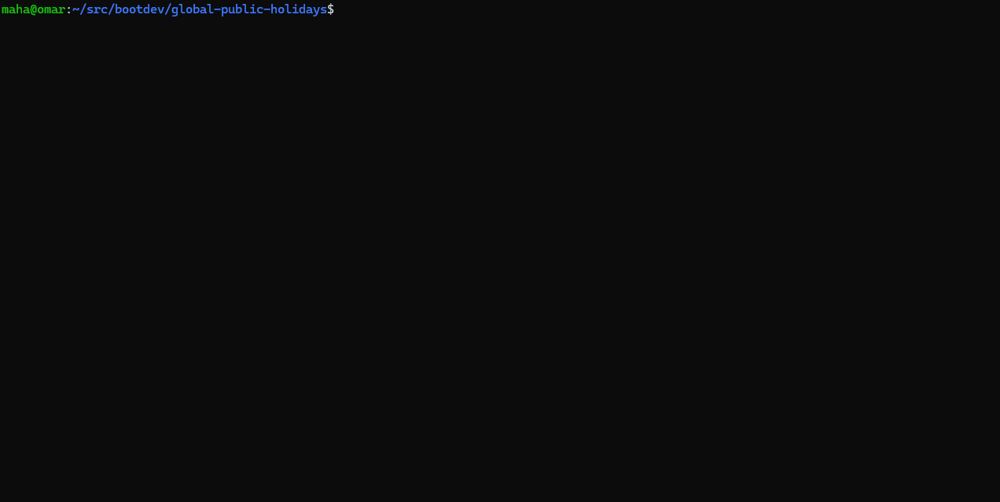

# Overview

The Global Holidays Explorer is a fun project that provides a platform for displaying public holidays from around the world along with detailed information about each holiday.


# Features

 - Worldwide Coverage: Access an extensive database of public holidays from diverse countries using the wonderful (and free) [Nager.AT](https://date.nager.at/) API.

 - Informative Details: Get in-depth information about each holiday, including its origin, significance, traditions, and any associated historical or cultural context. This feature ensures that users gain a deeper understanding of the holidays they are exploring.

 - User-Friendly Interface: Enjoy a clean and intuitive interface for seamless navigation. The repository is designed with simplicity in mind, I use the plotly library to display a map of the world and pin each holiday on the map.

# Getting Started

To get started with the Global Holidays Explorer, follow these steps:

- Clone the Repository: Clone the repository to your local machine using the provided Git commands.

```bash
git clone https://github.com/your-username/global-holidays-explorer.git
cd global-holidays-explorer
```

- Install using NIX

```sh
nix develop
python main.py
```



1. Explore the Codebase: Take a look at the codebase to understand the structure and how the holiday data is organized.
2. Contribute: If you'd like to contribute to the project, follow the contribution guidelines outlined in the repository. Whether it's adding new holidays, improving documentation, or enhancing features, your contributions are welcome.
3. Integrate with Your Project: For developers, explore the API documentation to seamlessly integrate global holiday data into your applications.

# Contributions and Feedback

We encourage and appreciate contributions from the community. If you have suggestions, bug reports, or want to add new features, please open an issue or submit a pull request. Your feedback is crucial in making the Global Holidays Explorer a valuable resource for everyone.

Start exploring and celebrating the diverse holidays that our world has to offer with the Global Holidays Explorer!
